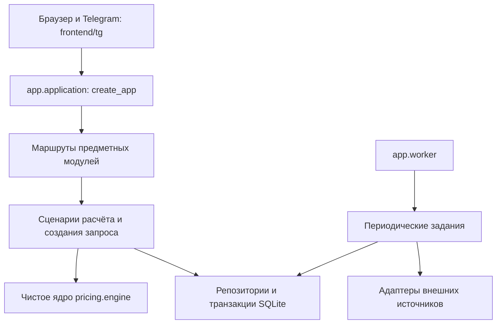

# Архитектура ИИ-сюрвейера

Реализовано 05.10.2026: модульный монолит на FastAPI и SQLite. HTTP-сервер и необязательный
фоновый исполнитель используют одну кодовую базу и одно хранилище. Микросервисы и новый
frontend-фреймворк для этой задачи не добавлялись.

## Точки входа и направление зависимостей

- `app/main.py` сохраняет адрес запуска `app.main:app` и несколько старых публичных импортов.
- `app/application.py` создаёт приложение, подключает полный список маршрутов, обработчики
  ошибок и защиту доступа. Ошибка импорта обязательного модуля останавливает запуск.
- `app/config.py` проверяет настройки процесса. Окружение имеет приоритет перед `.env`,
  затем `.secrets.env`; относительный `STORAGE_DIR` считается от корня проекта.
- `app/infrastructure/lifecycle.py` инициализирует базу и справочники во время startup/lifespan.
  Обычный импорт приложения не создаёт базу и не запускает задания.

Один процесс использует одно `STORAGE_DIR`: несколько баз через изменение глобальных путей
в одном сервере не поддерживаются. Тесты запускаются в отдельных процессах и копиях проекта.

## Владельцы логики

| Модуль | Ответственность и основные файлы |
|---|---|
| `modules/pricing` | `engine.py` — расчёт без HTTP, SQLite и модели; `schemas.py` — вход; `workflow.py` — сбор справочников и расчёт; `api.py` — HTTP и управление тарифными справочниками |
| `modules/surveys` | `workflow.py` — создание запроса; `repository.py` — запрос, объект, риски, расчёт, проверки и рекомендации в одной транзакции; `api.py` — HTTP |
| `modules/documents` | `storage.py` — проверка доступа, ограниченный поток, уникальное имя и удаление файла при ошибке записи; `api.py` — загрузка вложения |
| `modules/identity` | `access.py` — общая политика доступа к запросу; `app/access.py` сохраняет старый импорт |
| `modules/market` | Рыночные маршруты и общая операция обновления для кнопки и расписания |
| `modules/finance` | Маршруты финансовых показателей, резервов, ёмкости и накопления |
| `ui` | Общая раскладка страниц, тема и страницы операционного состояния; не импортирует `main` |
| `infrastructure` | Жизненный цикл, миграции, блокировки процессов, расписание и состояние приложения |

Маршруты оставшихся реализаций распределены по этим владельцам в `application.MODULES`.
Существующие `act_pkg`, `legal`, `act_texts`, `portfolio`, `auth`, адаптер модели `llm` и
адаптеры открытых источников пока сохраняют свои адреса импорта. Их перенос не нужен
для выполнения нового сценария расчёта; крупные внутренние реализации ещё требуют
последовательного упрощения. Это не утверждение, что весь старый код уже разобран.

В продукте остаются два разных расчётных пути: основной тарифный расчёт `pricing.engine`
и специализированный акт `act_engine` вместе с `risk_analytics`. Их предметные правила
не объединялись и формулы в рамках рефакторинга не изменялись.

## Хранение и миграции

`app/db.py` предоставляет транзакции, пул, снимки и кэш справочников. SQLite остаётся
единственной поддерживаемой базой. Непустой `DATABASE_URL` вызывает понятную ошибку
настройки, вместо молчаливого использования другого хранилища.

`schema_migrations` хранит применённые версии. Версия 1 использует проверяемый переход
старой схемы из `infrastructure/legacy_schema.py` и `db/schema.sql`. Перед изменением
существующей схемы создаётся SQLite-снимок в `STORAGE_DIR/backups/before-migration-*.db`.
Старая схема доводится идемпотентными шагами; версия записывается после успешной проверки
внешних ключей. Переход включает DDL с фиксациями: снимок нужен для восстановления при
сбое, это не обещание одной атомарной транзакции для всех старых схем.

По умолчанию `SURVEYOR_AUTO_MIGRATE=1`. При `0` сервер требует актуальную версию;
отдельное обновление выполняется `python -m app.migrate`. Новые изменения схемы получают
следующую миграцию и тест перехода. Существующий файл базы не заменяется даже при
отсутствии таблицы `products`. `tools/db_build.py` остаётся инструментом первичной сборки
и поставки справочников, не командой миграции рабочей базы.

## Фоновые задания

- `SURVEYOR_BACKGROUND_MODE=embedded` — прежний удобный локальный режим, расписание в сервере.
- `SURVEYOR_BACKGROUND_MODE=external` — расписание запускается командой `python -m app.worker`.
  Сервер и worker должны видеть один каталог хранения. Это два процесса монолита.
- `SURVEYOR_NO_BACKGROUND=1` выключает фоновые задания; worker при таком флаге отказывается стартовать.

ОС удерживает `worker.lock`, поэтому второй планировщик не начинает работу. При аварийном
завершении блокировка снимается ОС; удалять файл блокировки вручную не требуется.
Ожидания расписания прерываются при остановке. Уже выполняющийся сетевой запрос ограничен
таймаутом соответствующего адаптера; остановка не обещает мгновенно отменить чужой код.
Обновление НАПП также защищено отдельной блокировкой между ручным вызовом и worker.

Worker выделяет **периодические** задания. Загрузка документов и ручные операции по-прежнему
обрабатываются сервером. Долговечной очереди с гарантированными повторами пока нет;
добавлять её следует при появлении требований к такому выполнению. `/health` показывает
потоки текущего процесса и даты данных в общей базе; это не монитор удалённого worker.

## Общий интерфейс

`frontend/tg/` содержит редактируемые HTML/CSS/JS для браузера и Telegram. Сборщик
`tools/tg_build.py` создаёт `app/tg.html`; проверка соответствия — `--check`.
Старые отдельные страницы остаются в `app/` и используют общую раскладку `app/ui/pages.py`.
Node нужен для проверки JavaScript в тестах; штатная отдача интерфейса не требует Node/npm.

## Проверки и границы

`tools/test_all.py` выполняет собственные точки входа всех тестовых скриптов, создаёт
изолированную копию кода, строит базу из справочников и готовит синтетические примеры.
Рабочая база, `.env`, клиентские загрузки и токены не копируются. Внешние соединения Python
заблокированы, loopback разрешён для ASGI/asyncio. Результаты сохраняются в `sandbox/test-runs/`.

`tests/test_architecture.py` проверяет отсутствие побочных эффектов импорта, сохранение
255 путей API, ошибки регистрации модулей, конфигурацию, чистоту расчётного ядра,
откат создания запроса, обработку вложений, миграции и запуск/остановку расписания.
`tests/fixtures/` описывает происхождение контрольных примеров.

Крупные оставшиеся места для дальнейшего упрощения: `act_engine.py`, `contract_read.py`,
`risk_analytics.py`, `portfolio.py`, `llm.py`. Переносить их следует по проверяемому сценарию,
без механического деления на мелкие функции и без изменения страховых правил попутно.
